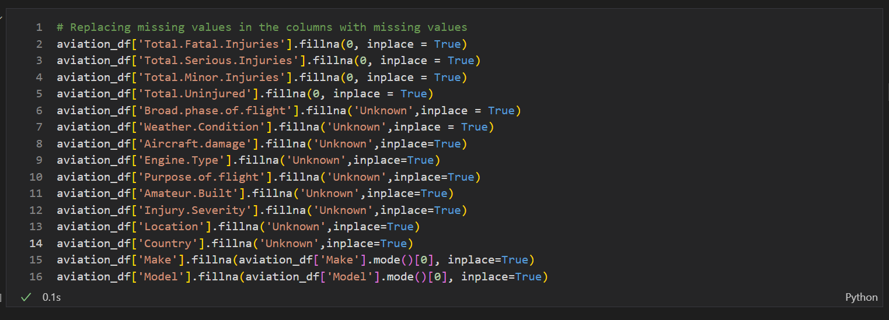
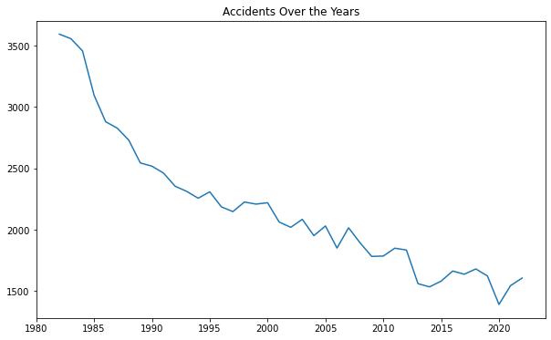
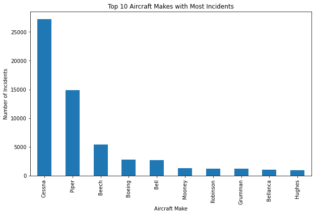
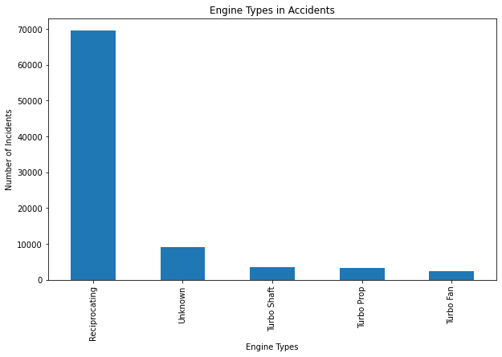
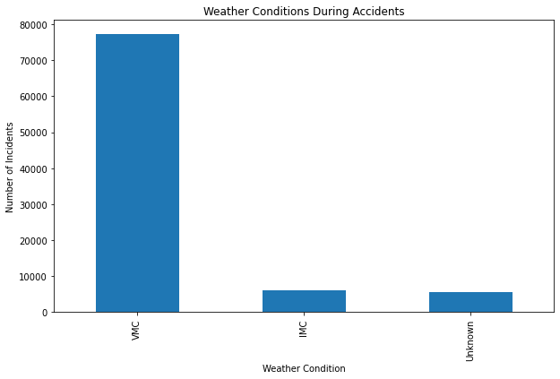
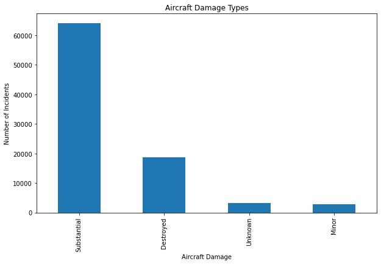

# Project Exploratory Data Analysis

## Description of the Project

The project focuses on enabling the company's entry into the aviation industry by analyzing data to identify aircraft that pose the lowest operational and safety risks. The goal is to provide data-driven insights into aircraft models, incident rates and failure points including environmental factors such as weather conditions and locations. By assessing historical safety records, incidents and trends in failure types, this analysis creates comprehensive risk profiles for various aircraft. The findings aim to guide the aviation division in selecting aircraft that are not only safe but also operationally reliable, minimizing risks and maximizing efficiency in the new venture. 

In addition, the project will explore how aircraft perform under diverse operational environments, factoring in weather conditions to evaluate resilience and adaptability. By investigating correlation between aircraft quality including make, model, engine type and number of engines and their safety, it uncovers key indicators for selecting durable and dependable aircraft. The project then translates analytical results to actionable recommendations that align with the company's strategic goals ensuring a successful and informed expansion into aviation.

## The Business Questions
1. How have the number of aviation accidents changed over the years?
2. Which aircraft models are involved in the most incidents and are certain engine types associated with higher incident rates?
3. Are certain weather conditions more likely to result in severe injuries or fatalities?
4. What are the most common types of aircraft damage in accidents?

## Project Objectives

- Analyze accident trends to understand aviation risks over time.
- Determine the safest aircraft models and engine types.
- Evaluate the impact of weather conditions on aircraft safety.
- Assess aircraft damage patterns to identify durable and reliable models.

## Project Analysis Steps

1. Loading and Understanding the Data
    - Importing the data with the necessary libraries
    
    - Recognising the rows and columns of the dataset, inspecting for duplicates and identifying missing values.
2. Cleaning and Normalizing the Data
    - Dropping, replacing and filling missing values.

    

    - Adding necessary columns for derived features. 

3. Data Visualization and Analysis

    Objective 1: Analyze accident trends to understand aviation risks over time. 

    

    Objective 2: Determine the safest aircraft models and engine types.

    

    

    Objective 3: Evaluate the impact of weather conditions on aircraft safety
    
    

    Objective 4: Assess aircraft damage patterns to identify durable and reliable models
    
    

## Findings 

### Objective 1: Analyze Accident Trends over time

Yearly Trends

- There was a decline in the number of accidents over the years which may be due to improvements in the aviation safety measures and procedures or advancements in technology

Monthly Trends

- Certain months may have had higher accident rates possibly due to the seasons for example the summer seasons in June, July and August months. 
- Months with fewer accidents may indicate periods of reduced air traffic or favorable weather conditions. 

### Objective 2: Identify Aircraft Models with the most Incidents

Aircraft Makes 
- Particular makes may have had a higher rate of accidents which could be due to their regular use and popularity.

Aircraft Models
- Certain models may have significantly higher incident rates which could be due to their popularity or design issues.
- Models with fewer incidents may indicate better safety records or less frequent use.

Engine Types
- Specific engine types may be associated with higher incident rates possibly due to mechanical sophistication, maintenance problems or certain operational conditions.
- Engine types with fewer incidents may indicate better realibility or suitability for certain conditions.

### Objective 3: Investigate the Impact of Weather Conditions

Weather Conditions
- A large proportion of accidents occuring under clear weather conditions may suggest that human error or mechanical failure is a significant factor.
- Higher accident rates under adverse weather conditions may highlight the need for better weather forecasting, pilot training or equipment upgrades. 
 
### Objective 4: Analyze Aircraft Damage Patterns

Types of Damage
- Certain types of damage e.g. 'Destroyed' dominatig the dataset may indicate the severity of many incidents.
- Less severe damage e.g. 'Substantial' may suggest incidents where safety measures or emergency responses were effective in minimizing harm. 

## Recommendations

- The business should focus on low-risk aircraft models with the lowest incident rates and have a history of realibity. They should consider avoiding models with high incident rates unless there are mitigation strategies in place. These would reduce operational risks and build trust with clients by prioritizing safer aircraft models.

- The business should consider focusing on engine types with low incident rates and can be realible and should implement predictive maintenance systems to monitor engine performance and prevent failures. These would minimize downtime and maintenance costs while ensuring operational safety and realibility. 

- The business should choose aircraft equipped with advanced weather detection systems and avionics to handle adverse weather conditions effectively. This would reduce weather-related risks and ensure safer operations in diverse environmental conditions. 

- The business should consider investing in aircraft with advanced safety features e.g. fire supression systems and effective evacuation mechanisms. This would improve passenger safety and reduce the likelihood of catastrophic losses in the event of an incident. 

### Conclusions 

- The business should consider prioritizing low-risk aircraft models as they are the safest options for the business to invest in.

- The business should emphasize reliable engine types as they are critical for ensuring operational safety and minimizing maintenance costs.

- The business should consider investing in weather-resilient aircraft and training pilots to handle challenging conditions to reduce weather-related risks and ensure safer operations.

- The business should consider investing in advanced safety features like fire suppression systems and effective evacuation mechanisms better equipped to handle emergencies. 

[GitHub](https://github.com/billysambasi/phase_1_project.git)
[Tableau Project Dashboards](https://tinyurl.com/projectdashboards) 

### Project Folder Structure

phase_1_project/
├── data/
│   ├── cleaned_data/     	# Cleaned datasets
│   ├── raw_data/         	# Uncleaned datasets
├── embedded_images/		# Images embedded in the README.md file
├── .gitignore             	# Git ignore file
├── index					# Project file 
├── LICENSE               	# License for the project
├── project_presentation 	# Project PowerPoint presentation
├── README.md          		# Project documentation
